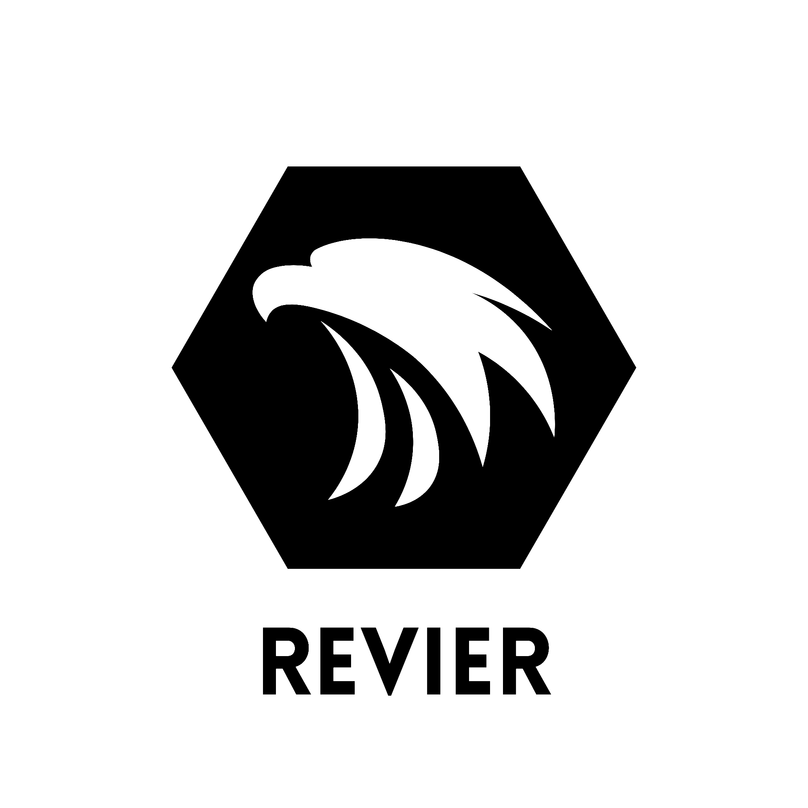

<p align="center">
<picture>
  <source width="50%" height="50%" media="(prefers-color-scheme: dark)" srcset="./docs/RevierLogoDark.png">
  
</picture>
  </p>

<h1 align="center">From Everyone to Everyone</h1>

<p>Revier is an vulkan based game engine that is aimed to provide the future generations the knowledge and principals of programming and problem solving</p>

## ```Current Goals:```
- [ ] "Revier Editor" prototype
- [ ] "Revier Runtime" prototype
- [ ] "Revier Crates" prototypes
- [ ] "Revier Hub" prototype
- [ ] "Revier Editor Full Version" finished
- [ ] "Revier Runtime Full Version" finished
- [ ] "Revier Crates Full Version" finished
- [ ] "Revier Hub Full Version" finished
- [ ] "Going global!" achieved


