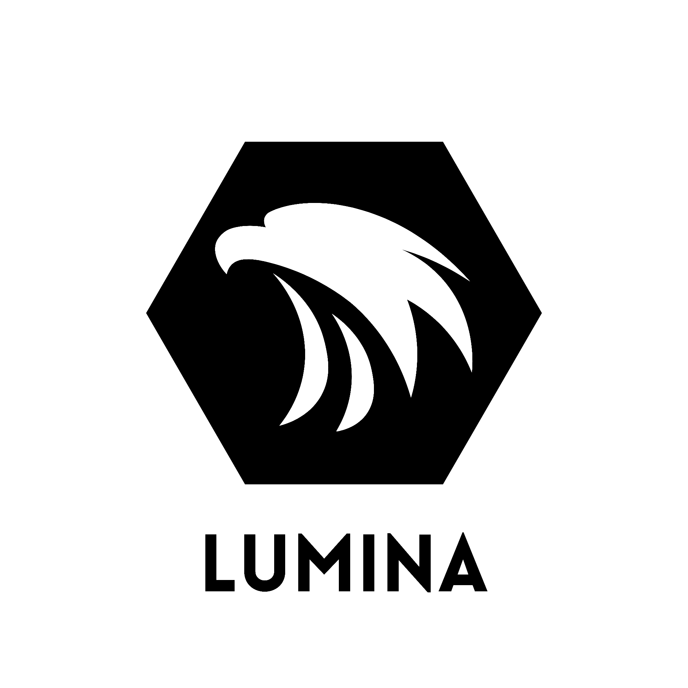

<div align="center" style="display: flex; flex-direction: column; align-items: center;">
  
  <picture style="width: 50%; height: 50%;">
    <source media="(prefers-color-scheme: dark)" srcset="./docs/LuminaLogoDark.png">
  </picture>
</div>


<h1 align="center">From Everyone to Everyone</h1>

<p>Lumina is an vulkan based game engine that is aimed to provide the future generations the knowledge and principals of programming and problem solving</p>

## ```Current Goals:```
- [ ] "Lumina Editor" prototype
- [ ] "Lumina Runtime" prototype
- [ ] "Lumina Crates" prototypes
- [ ] "Lumina Hub" prototype
- [ ] "Lumina Editor Full Version" finished
- [ ] "Lumina Runtime Full Version" finished
- [ ] "Lumina Crates Full Version" finished


